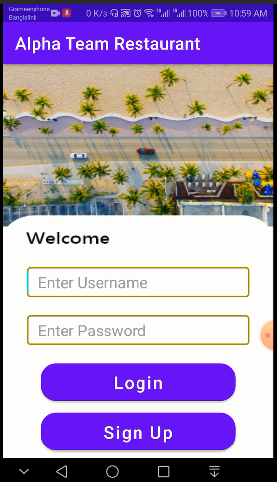
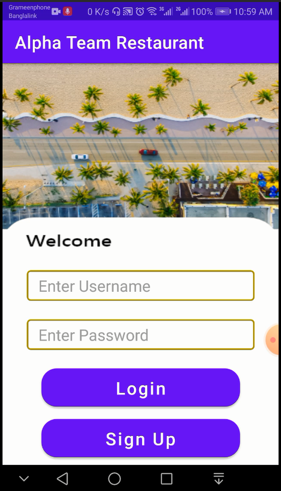
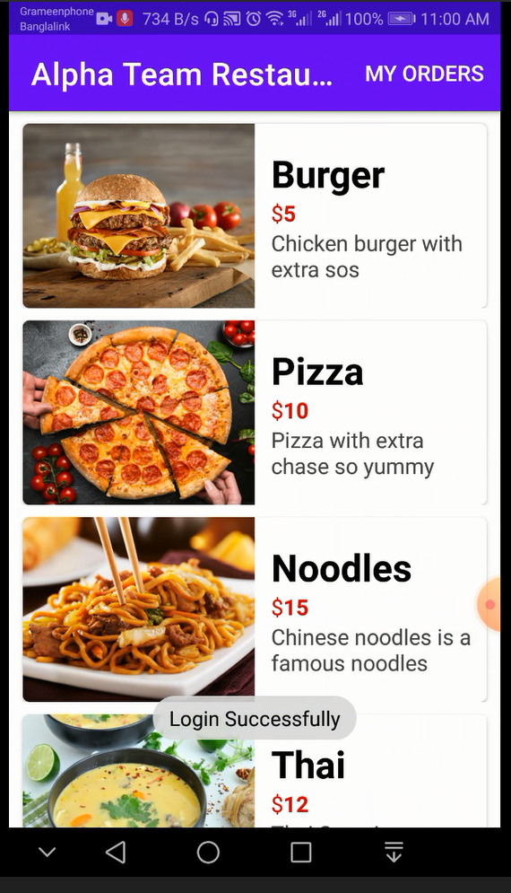
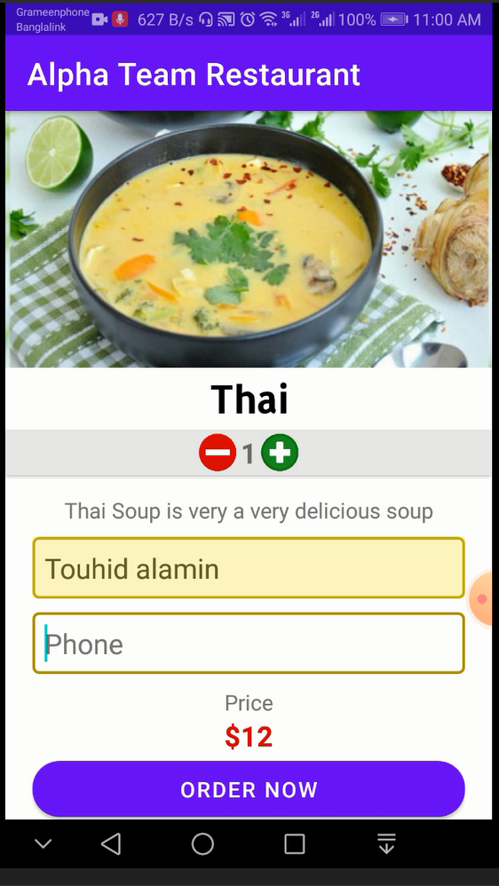

# Food Ordering Android App

> <cite>Made By Touhidur Rahman</cite>

**Table of Content**

1. [Summary](#summary)
1. [Login Section](#login-section)
1. [Sign Up Section](#sign-up-section)
1. [Food List Section](#food-list-section)
1. [Food Order Section](#food-order-section)
1. [Food Order List Section](#food-order-list-section)

## Summary:

I implemented a Food ordering android app using Java Programming Language and SQLite as its database. This app has an authentication system using _Username and Password_ A user can open an account if he doesn't have any. After successfully pass the authentication he can see the food list in the app the food list is hard codded because I haven't implemented the Dashboard but from the food list he can see the food, can order and after order, he can manipulate the order too.

## Login Section

Here you can login but if you don't have account you need up sign up

## Sign Up Section

## Food List Section

## Food Order Section

## Food Order List Section

